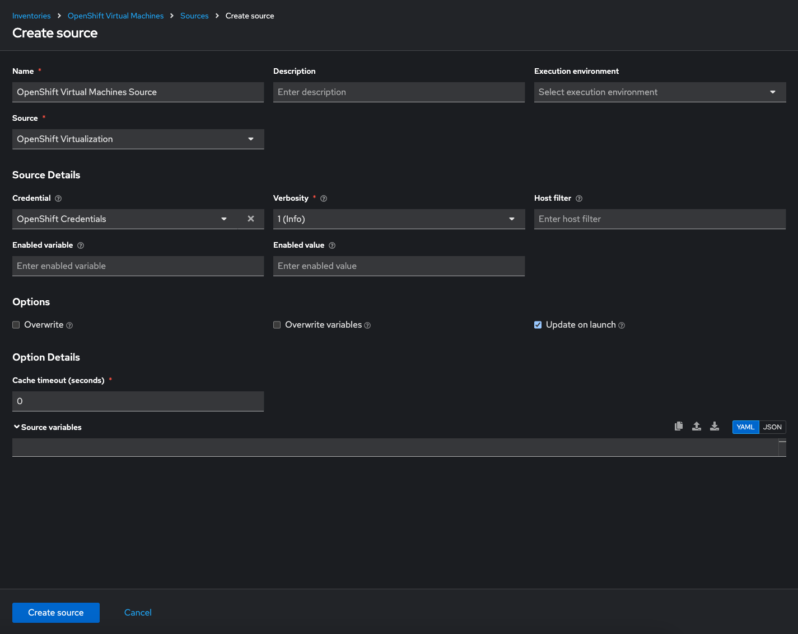
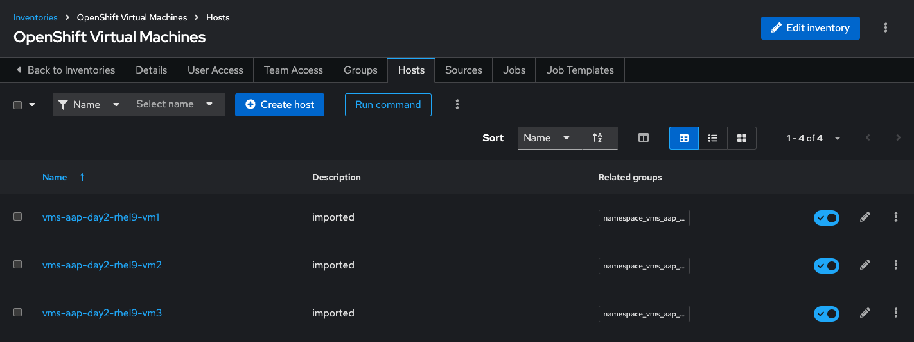

= Creating a Dynamic Inventory for OpenShift Virtual Machines

== Lab Overview
Dynamic inventories allow Ansible Automation Platform (AAP) to automatically
fetch and update the inventory of systems from external sources, eliminating
the need for manual inventory management. 

In this lab, we will configure a dynamic inventory to pull data from OpenShift
Virtualization. This will enable AAP to manage OpenShift VMs residing in the
`vms-app-day2` namespace of an OCP cluster.

== Create an Inventory

. Navigate to **Automation Execution → Inventories**.
+
. Select the **Create inventory** button.
+
. In the **Create Inventory** form:
   * Provide a name: `OpenShift Virtual Machines`.
   * Select `Default` as the Organization.
+
. Click the **Create inventory** button.
+
image::../assets/images/create_inventory.png[title="Create Inventory"]

== Add a Source to the Inventory

. After creating the inventory, switch to the **Sources** tab.
+
image::../assets/images/sources.png[title="Sources"]
+
. Select the **Create source** button.
+
. In the **Create Source** form:
   * Provide a name: `OpenShift Virtual Machines Source`.
   * Select `OpenShift Virtualization` as the Source type.
   * Choose `Default Execution Environment` as the execution environment.
   * Add your OpenShift Credential (Bearer Token)
+
. Click the **Create source** button to save the configuration.
+

==  Update the Inventory
. Launch the inventory update:
   * Navigate to the **Details** window for the newly created source.
   * Click the **Launch Inventory Update** button in the top-right corner.
+
image::../assets/images/update_inventory.png[title="Update Inventory"]
+
. Wait for the **Last Job Status** to show `Success`.

== Verify the Inventory
. Once the update completes successfully:
   * Click the **Back to Inventory Sources** button.
   * Switch to the **Hosts** tab.
+
. Confirm that the Virtual Machines from the `vms-app-day2` namespace of your OpenShift cluster are listed as inventory hosts.
+

== Conclusion
You have successfully created a dynamic inventory in Ansible Automation Platform
that reflects your OpenShift Virtual Machines. This inventory is now ready for
use in automation tasks.

